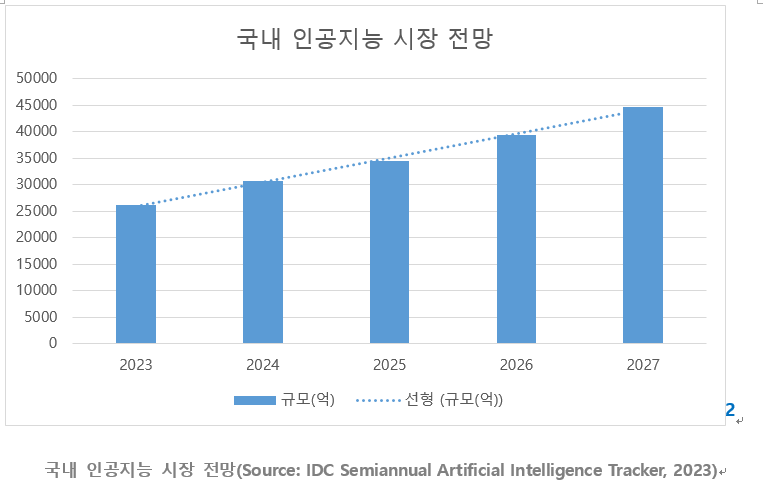
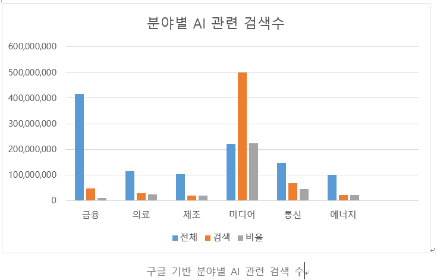

# 생성형 AI를 활용하는 분야와 동향

> 요약 – 현재 생성형 AI가 가장 활발하게 활용되는 분야로 금융, 의료, 제조, 미디어, 통신, 에너지가 있다. 생성형 AI가 현재 어떤 산업에 이용되고 있으며 그 산업의 특성을 이해한다면 지금의 기술의 발전을 이해하게 되고 올바르게 기술을 사용할 수 있다.

## 서론

 최근 AI기술이 꾸준히 발전함에 따라 인공지능을 적용시켜 더 높은 가치를 생산하는 일이 많아졌다. 그 중 생성형 AI는 현 인공지능 기술 중 크게 주목받는 기법으로써 Amazon AWS에서는 다음 과 같이 서술하고 있다.
 “생성형 AI는 대화, 이야기, 이미지, 동영상, 음악 등 새로운 콘텐츠와 아이디어를 만들 수 있는 인공 지능의 일종입니다. 모든 인공 지능과 마찬가지로 생성형 AI는 기계 학습 모델, 즉 방대한 양의 데이터로 사전 훈련되며 일반적으로 파운데이션 모델(FM)이라고 불리는 대규모 모델을 기반으로 구동됩니다. 생성형 AI는 콘텐츠 제작 외에 디지털 이미지의 품질을 개선하고, 동영상을 편집하며, 제조용 프로토타입을 빠르게 제작하고, 가상 데이터 세트로 데이터를 보강하는 등의 작업에도 사용됩니다.”  
 해당 글에서는 이러한 생성형 AI가 현재 산업에 어떠한 영향을 미치고 가장 영향을 크게 주는 6가지 분야에 대해 알아보고자 한다. 

## 본론
 1.	금융 서비스
 2020년 PWC(프라이스워터하우스쿠퍼스)가 발표한 AI 임팩트 지수에 의하면 금융업은 헬스케어, 자동차에 이어 영향력이 클 것으로 예측했다. 
 2.	의료 및 생명 과학
 우리나라 헬스케어 기업들도 이에 주목하고 있다. 카카오브레인, 루닛, 웰트 등 국내 기업들이 의료 분야의 생성형 AI 개발을 추진하고 있으며, 정부도 이에 발맞춰 오는 2024년 11월까지 생성형 인공지능 의료기기(AIMD) 허가·심사 가이드라인을 개발하겠다고 밝혔다. 
 3.	자동차 및 제조
생성형 AI는 자동차 제품 수명 주기를 넘어 자율주행차(AV) 개발에도 새로운 돌파구를 마련하고 있습니다. 이러한 연구 분야에는 기록된 센서 데이터를 완전한 인터랙티브 3D 시뮬레이션으로 전환하기 위해 신경 방사장(NeRF) 기술을 사용하는 것이 포함됩니다. 이러한 디지털 트윈 환경과 합성 데이터 생성은 엄청난 규모의 AV를 개발, 테스트 및 검증하는 데 사용될 수 있습니다. 
 4.	미디어 및 엔터테인먼트
생성형 인공지능으로 단편 영화와 애니메이션 영상 등이 제작되고 있다. 안정기 작가는 “딥한 기술이 필요하지 않다. 이미지, 텍스트, 음성, 음악, 버츄얼 휴먼을 만들어주는 다양한 생성형 인공지능 툴들이 존재하고 있다. 그 툴들 몇 가지를 조합해 영화와 애니메이션 영상을 만들고 있다”고 설명했다. 
 5.	통신
국내 이동통신사는 거대언어모델(LLM)을 활용한 생성형 인공지능(AI) 기술로 새 성장 동력 마련에 한창이다. 개인용(B2C) 영역뿐만 아니라 인프라부터 솔루션, 응용서비스까지 전 과정을 제공하는 'AI 풀스택' 전략을 앞세워 기업용(B2B)까지 입지를 넓힌다. 
 6.	에너지
에너지 분야에서 가장 친숙한 방식으로는 셸(Shell)이 지난 2015년부터 시작한 인공지능 기반 도우미 서비스를 예로 들 수 있습니다. 셸은 AI 도우미 엠마(Emma)와 에단(Ethan)이란 두 챗봇을 배치해 셸 제품 구매와 관련해 일주일 내내 24시간의 지원을 제공하는 대화형 원스톱 스토어를 운영하고 있습니다.  

## 결론
 우리는 AI 알파고부터 시작하여 눈부신 AI의 발전을 보고있는 세대이다. 최근에 개발된 생성형 AI ChatGPT와 같이 현재 우리는 이러한 기술의 발전에 많은 관심을 가질 수 밖에 없다. 현 시대에 이르기 까지 문명은 기술의 발전에 따라 그 기술을 어떻게 사용하는지가 대단히 중요하다는 것을 알고있다. 생성형 AI는 이름 그대로 생산성을 높이기 위함임을 알 수 있다. Goldman Sachs에 따르면 생성형 AI는 전 세계 GDP를 7%(또는 약 7조 USD) 증가시키고 10년 동안 생산성을 1.5% 포인트 높일 수 있다고 하며, 이러한 긍정적인 예측은 앞으로 우리가 어떻게 하느냐에 따라 달라진다.  따라서 생성형 AI가 현재 어떤 산업에 이용되고 있으며 그 산업의 특성을 이해한다면 지금의 기술의 발전을 이해하게 되고 올바르게 기술을 사용할 수 있다고 본다. 

### 참고문헌
[1] https://aws.amazon.com/ko/what-is/generative-ai/
[2] https://newsroom.koscom.co.kr/33754?print=pdf
[3] 출처 : 청년의사(http://www.docdocdoc.co.kr)
[4] https://blogs.nvidia.co.kr/2023/08/16/generative-ai-auto-industry/
[5] 출처 : 미디어오늘(http://www.mediatoday.co.kr)
[6] https://www.etnews.com/20230915000043
[7] https://story.s-oil.com/2023/01/18/
[8] https://aws.amazon.com/ko/what-is/generative-ai/
